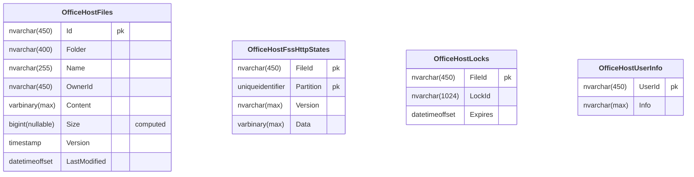

```mermaid
erDiagram
  OfficeHostFiles["**OfficeHostFiles**"] {
    nvarchar(450) Id pk
    nvarchar(400) Folder
    nvarchar(255) Name
    nvarchar(450) OwnerId
    varbinary(max) Content
    bigint(nullable) Size "computed"
    timestamp Version
    datetimeoffset LastModified
  }
  OfficeHostFssHttpStates["**OfficeHostFssHttpStates**"] {
    nvarchar(450) FileId pk
    uniqueidentifier Partition pk
    nvarchar(max) Version
    varbinary(max) Data
  }
  OfficeHostLocks["**OfficeHostLocks**"] {
    nvarchar(450) FileId pk
    nvarchar(1024) LockId
    datetimeoffset Expires
  }
  OfficeHostUserInfo["**OfficeHostUserInfo**"] {
    nvarchar(450) UserId pk
    nvarchar(max) Info
  }
```